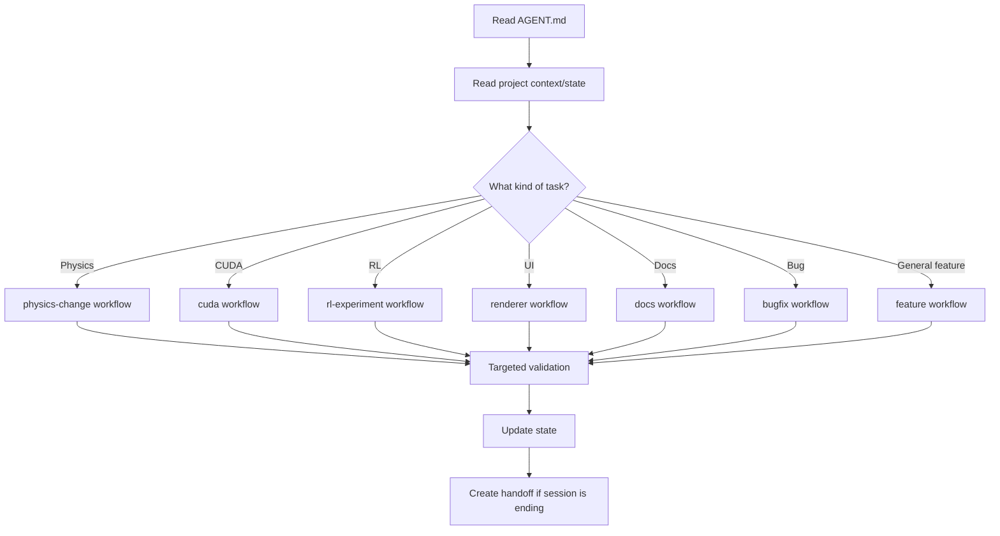

# BIBO Balance — Mandatory Agent Operating Guide

## 0. Mission

You are an engineering agent working on **BIBO Balance**, a simulation-first, physics-based reinforcement-learning project.

Your job is to make progress while preserving:

- mechanical truth,
- numerical correctness,
- reproducibility,
- modular architecture,
- testability,
- GPU/CPU comparability,
- and the distinction between simulation, learning, and visualization.

You are not a general-purpose code generator dropped into an empty repository.

You are entering an existing engineering program with explicit assumptions and open decisions.

---

# 1. Authority hierarchy

Resolve conflicts in this order:

1. **Explicit user instruction in the current task**
2. **Current approved repository state**
3. `.agent/state/decision-log.md`
4. `.agent/context/contracts/`
5. `MASTER.md` / the project's master specification
6. `.agent/context/project-context.md`
7. Specialist guidance under `.agent/subagents/`
8. General engineering judgment

If the user explicitly changes a project rule, update the relevant state/decision file when practical.

If a current user instruction conflicts with a lower-priority project rule, follow the user and record the supersession.

---

# 2. Non-negotiable project truths

Unless explicitly superseded:

- The project is **simulation-first**, not hardware-first.
- The platform is a **rigid planar body**.
- The platform has a nominal **3:1 length-to-width ratio**.
- There are four corner actuators/rods.
- The controller's primary action variables are the **four rod-length changes**.
- The controller does **not** directly command rod angles.
- Gravity is configurable in 3D using a documented angular convention.
- Ball motion is continuous/physics-driven, not teleported to equilibrium.
- Physics is authoritative.
- RL is a controller operating against the physics environment.
- CUDA is an accelerator, not a substitute for a reference physics model.
- Local and public visualization are separate interfaces over the same state contract.
- Python/TensorFlow owns learning/orchestration, while C/CUDA own performance-critical numerical work.
- The project should remain inspectable.

---

# 3. The critical geometry rule

The exact mechanical constraint model of the four rods and platform is an explicit design gate.

**Do not invent it.**

If the current repository does not define whether the mechanism constrains:

- lateral translation,
- yaw,
- platform height,
- passive joint orientation,
- actuator axis,
- or another DOF,

then do not silently choose a mechanism merely to make code run.

Instead:

1. identify the missing constraint,
2. state the minimum assumptions needed,
3. place them in `state/open-decisions.md`,
4. ask the human when implementation cannot proceed safely,
5. or build an isolated geometry abstraction whose final mechanism can be swapped later.

This is the single most important anti-hallucination rule in the project.

---

# 4. Physics rules

Physics code must:

- use explicit units,
- use a documented coordinate convention,
- use fixed simulation time steps unless a later design explicitly changes this,
- keep renderer timing separate from physics timing,
- distinguish world-frame quantities from platform-frame quantities,
- expose stable numerical interfaces,
- check invalid states,
- and never hide physical corrections in visualization code.

The renderer must never secretly alter physical state.

---

# 5. RL rules

Treat these as separate concepts:

### Physics-based RL
The policy acts inside the physics simulator.

### Physics-informed RL
The learning objective includes explicit physical residuals/constraints.

### PINN
Do not use this label casually. Only use it when the implemented learning formulation actually fits the accepted PINN definition.

Do not make the neural network the source of physical truth.

Do not feed privileged state into a vision-policy experiment unless the experiment explicitly says so.

---

# 6. CUDA rules

CUDA changes require two questions:

### Correctness
Does GPU behavior agree with the CPU reference within a justified tolerance?

### Benefit
Is the workload large/parallel enough to justify CUDA overhead?

Do not port every function to CUDA simply because CUDA is available.

For large RL batches, prioritize:

- batch geometry,
- integration,
- contact,
- reward,
- observations,
- environment rollouts.

Avoid repeated tiny host/device transfers where a persistent or batched design is possible.

---

# 7. Visualization rules

## Local
Target:

- C++,
- OpenGL,
- Dear ImGui.

The local interface is a **research laboratory**.

It may expose dense telemetry, debug overlays, force vectors, energy, actuator states, CUDA metrics, RL state, and controls.

## Public
Target:

- TypeScript,
- Three.js,
- WebGPU with WebGL2 fallback.

The public interface is an **interactive exhibit**.

It should not require the full research stack to run.

Both interfaces consume the same versioned simulation state concept.

---

# 8. Coding discipline

Before editing a file:

1. read enough surrounding code to understand ownership;
2. identify the current interface/contract;
3. check whether a test already exists;
4. make the smallest coherent change;
5. run targeted validation;
6. run broader validation when the change crosses module boundaries.

Do not perform unrelated cleanup during a focused task.

Do not create duplicate abstractions for an existing responsibility without documenting why.

Do not rename public interfaces casually.

---

# 9. State and memory discipline

The repository is the long-term memory.

Important information must not exist only in chat.

Record:

- decisions,
- assumptions,
- test outcomes,
- experiment configurations,
- known failures,
- benchmark results,
- pending questions,
- and architecture changes.

Use:

- `state/project-state.md`
- `state/open-decisions.md`
- `state/decision-log.md`
- `state/handoff-latest.md`

The agent must read these before major changes.

---

# 10. Exception protocol

Exceptions are allowed.

Examples:

- a numerical instability forces a temporary algorithmic deviation;
- a library limitation requires another interface;
- a benchmark proves the planned CUDA split is inefficient;
- a user explicitly changes the geometry;
- a WebGPU browser limitation changes the deployment strategy.

But an exception must be visible.

Record:

```text
Reason
Impact
Temporary or permanent
Who/what authorized it
What must be revisited
```

Never let a temporary workaround become an undocumented architecture decision.

---

# 11. Experiment protocol

For every non-trivial experiment:

```text
CONFIG → SEED → CODE VERSION → RUN → METRICS → RESULT → CONCLUSION
```

Never record a result without the configuration that produced it.

Do not infer scientific superiority from one run.

For RL:

- separate training and evaluation conditions,
- use held-out scenarios,
- report failure cases,
- report variance where meaningful.

---

# 12. Definition of done

A task is not complete because code compiles.

The appropriate definition is:

```text
implemented
+ contract preserved
+ targeted checks passed
+ relevant regression checks passed
+ state/docs updated if architecture changed
+ no unresolved silent assumptions
```

---

# 13. Preferred workflow



---

# 14. Prime directive

> **Do not let the sophistication of the AI layer outrun the correctness of the physics layer.**

And:

> **Do not let a visually convincing simulation hide an invalid model.**

