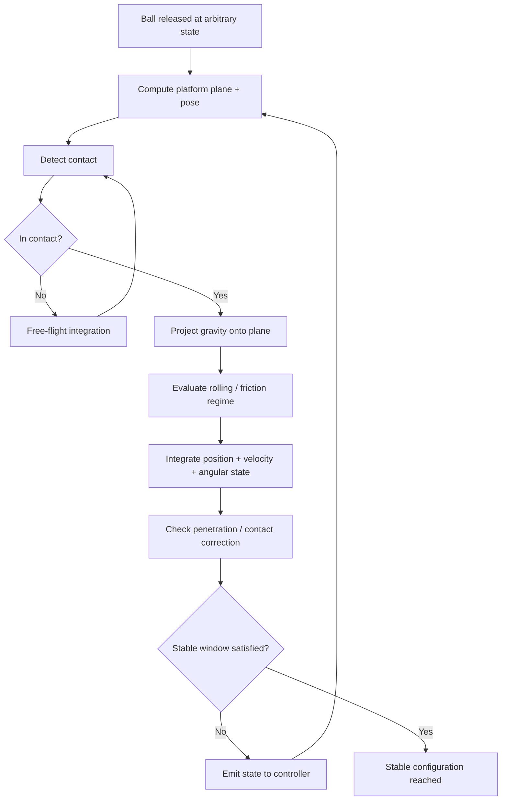
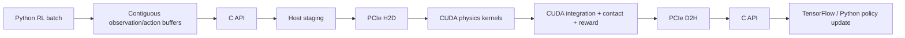
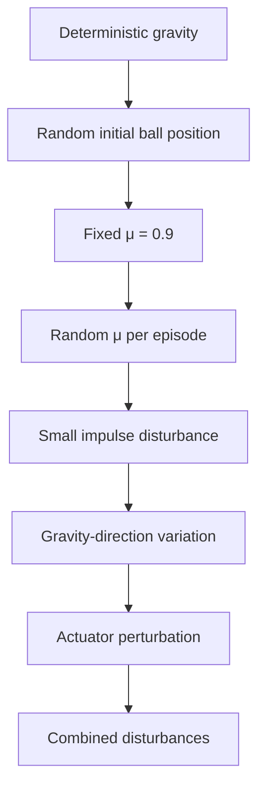
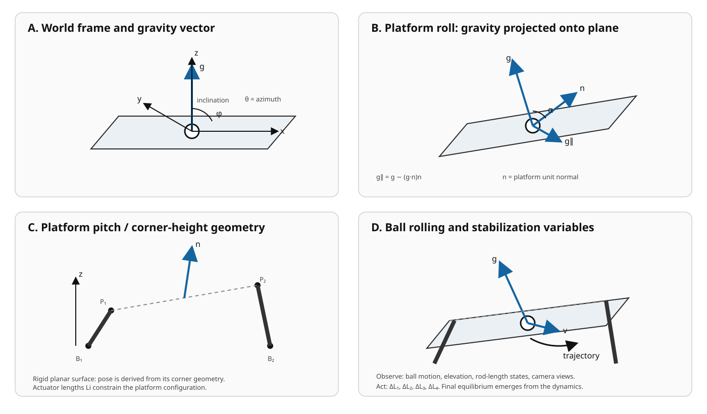
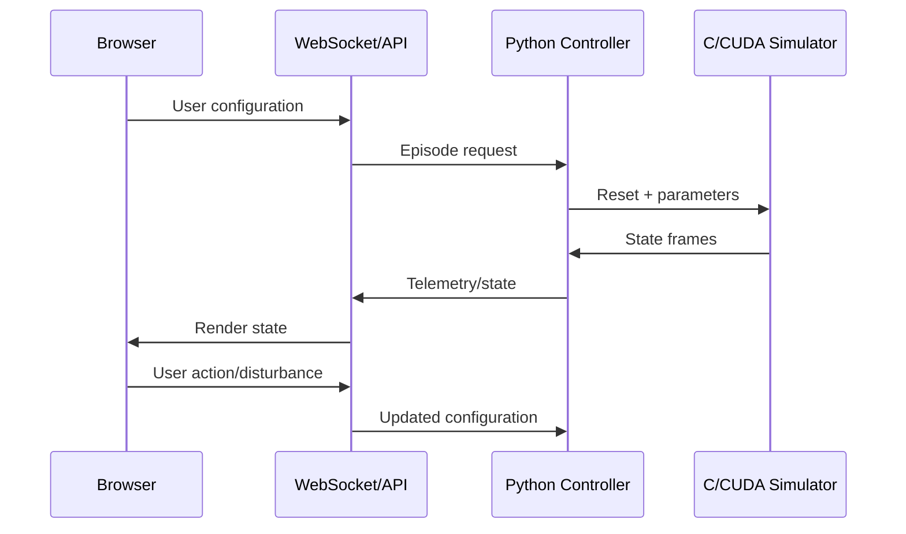
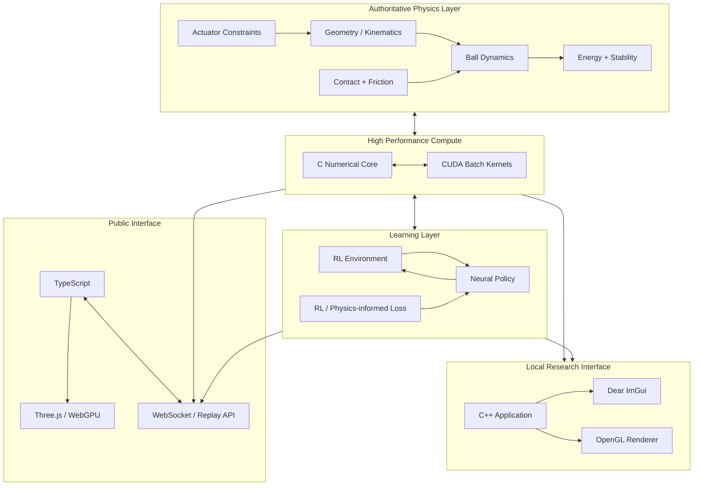
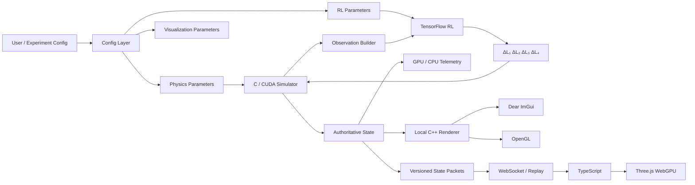
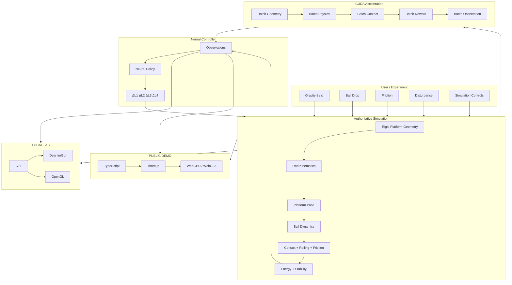

# BIBO Balance
## Master Project Specification, Physics, Architecture, RL Design & Build Plan

> **Working title:** **BIBO Balance**  
> **Descriptor:** *A CUDA-Accelerated, Physics-Based Reinforcement Learning System for 3D Ball Stabilization*  
> **Development mode:** Simulation-first  
> **Primary language stack:** C / CUDA / Python / TensorFlow  
> **Local visualization:** C++ + OpenGL + Dear ImGui  
> **Public visualization:** TypeScript + Three.js + WebGPU/WebGL2 fallback

---

## 0. Purpose of This Document

This is the **master source of context and implementation intent** for BIBO Balance.

It is meant to be readable by:

- the human developer,
- future coding agents,
- simulation/ML experiments,
- the local visualization layer,
- the public demonstration layer,
- and later physical-hardware work if the project ever moves beyond simulation.

The document is intentionally broader than a README. It contains the project's working assumptions, mathematical conventions, architecture, implementation sketches, development phases, validation rules, and decisions that should not be casually changed.

### Context anchor

The originating proposal describes a rectangular platform supported by four corner control rods, independently variable rod lengths, a ball dropped at arbitrary position/time, arbitrary 3D gravity direction, continuously sampled RL control, real-time visualization, and a simulation-first development strategy.

**Source context:** `BIBO balance.txt`, especially the statements covering the 3:1 platform, four rods, arbitrary ball drop, arbitrary gravity, RL observations/actions, visualization, and simulation-first intent.

---

# 1. The Core Idea

BIBO Balance is a **closed-loop physical control system in simulation**.

A rigid rectangular platform is supported by four independently controllable actuator rods. The controller does **not** directly command platform pitch, roll, yaw, or rod angles. The controller's actuator authority is:

$$
a_t =
\begin{bmatrix}
\Delta L_1 &
\Delta L_2 &
\Delta L_3 &
\Delta L_4
\end{bmatrix}
$$

where $L_i$ is the current length/state of actuator $i$.

Changing those lengths changes the platform configuration. The platform configuration changes the surface on which a ball rolls. The ball responds to gravity, contact, friction/rolling dynamics, and the moving platform. The controller observes the evolving system and continuously changes the rod lengths.

The central loop is therefore:

$$
\boxed{
\text{rod lengths}
\rightarrow
\text{platform pose}
\rightarrow
\text{ball dynamics}
\rightarrow
\text{observations}
\rightarrow
\text{neural policy}
\rightarrow
\text{rod-length changes}
}
$$

The final ball position is **not required to be a globally fixed coordinate**. A stable configuration is allowed to emerge from the coupled platform/ball dynamics and the controller's operating policy.

### Context anchor

The proposal explicitly specifies independent rod-length control as the output of the system and lists camera/state observations as inputs to a continuously sampled RL loop.

---

# 2. Design Philosophy

BIBO Balance should be developed from first principles:

> **"My advice is, if you want to make progress in things, the best analytical framework... is physics."**  
> — Elon Musk, World Government Summit

This quote is used here as a methodological reference, not as a scientific claim about BIBO itself. Musk has repeatedly described physics and first-principles reasoning as a framework for attacking counter-intuitive engineering problems. See the cited World Government Summit account in the References section.

The project should therefore follow four principles:

1. **Physics is authoritative.**  
   The simulator determines what physically happens.

2. **The neural network is a controller, not the source of physical truth.**  
   It chooses actuator actions. It does not redefine the equations of motion.

3. **The simulation state is explicit.**  
   No hidden UI state, duplicated state, or renderer-only state should become the authoritative source.

4. **Performance is engineered, not assumed.**  
   CUDA should be used where parallel simulation and numerical workloads justify it. A single tiny simulation step does not automatically become faster just because it runs on a GPU.

### Context anchor

The original proposal explicitly combines a continuously sampled RL controller with a physics simulation and calls for CUDA/C/Python/TensorFlow to support numerical computation.

---

# 3. Scope and Non-Goals

## 3.1 Primary scope

BIBO Balance should initially support:

- rigid planar rectangular platform,
- 3:1 platform length-to-width ratio,
- four corner actuators,
- independently controlled actuator lengths,
- arbitrary initial ball position on the platform,
- arbitrary ball release time,
- configurable 3D gravity direction,
- rolling/contact dynamics,
- friction,
- actuator limits,
- real-time simulation,
- RL-based continuous control,
- GPU-accelerated numerical simulation,
- local research UI,
- public interactive visualization,
- deterministic tests,
- reproducible experiments.

## 3.2 Non-goals for V1

Do **not** make V1 depend on:

- physical hardware,
- full rigid-body engine integration,
- real cameras,
- real servo electronics,
- a full PDE-level contact solver,
- a full magnetics/robotics hardware stack,
- browser-side training,
- a cloud GPU being permanently available,
- or an enormous neural architecture.

The first objective is a **correct, inspectable, deterministic simulator**.

### Context anchor

The source proposal ends with the explicit constraint that the project is **simulation-first rather than hardware-first**.

---

# 4. Mechanical Model

## 4.1 Platform

Let:

- $L_p$ = platform length,
- $W_p$ = platform width.

The intended aspect ratio is:

$$
L_p = 3W_p
$$

The platform is a **rigid planar body**.

A convenient local coordinate system is:

$$
u \in \left[-\frac{L_p}{2}, \frac{L_p}{2}\right]
$$

$$
v \in \left[-\frac{W_p}{2}, \frac{W_p}{2}\right]
$$

$$
w=0
$$

for the platform surface.

Its world pose can be represented as:

$$
\mathbf P_i = \mathbf t + R\mathbf C_i
$$

where:

- $\mathbf C_i$ = local coordinates of corner $i$,
- $R$ = platform rotation matrix,
- $\mathbf t$ = platform translation.

### Context anchor

The proposal specifies a rectangular platform whose length is approximately three times its width and four corner-connected control rods.

---

# 5. Actuator / Rod Geometry

## 5.1 Fundamental actuator variable

For each actuator:

$$
L_i = \text{instantaneous rod length}
$$

The controller acts on:

$$
\Delta L_i
$$

rather than directly commanding rod angles.

A normalized actuator state can also be defined as:

$$
\ell_i =
\frac{L_i-L_{i,\text{mean}}}
{L_{i,\text{scale}}}
$$

This matches the proposal's idea of giving the controller the instantaneous rod extension/retraction relative to a mean/reference.

## 5.2 Distance-constraint representation

If the rod joins a fixed base anchor $\mathbf B_i$ to a moving platform corner $\mathbf P_i$, the geometric constraint is:

$$
\boxed{
L_i = \|\mathbf P_i-\mathbf B_i\|
}
$$

or:

$$
\boxed{
\|\mathbf t+R\mathbf C_i-\mathbf B_i\|^2-L_i^2=0
}
$$

This equation should become the central mechanical constraint in the simulator.

## 5.3 Critical geometry gate

There is one issue that must be frozen **before implementing the final inverse kinematics**:

Four independent length values are not automatically equivalent to four unrestricted rigid-body pose degrees of freedom.

A rigid platform has six general pose DOF, while the mechanical arrangement may constrain lateral translation/yaw and leave a lower-dimensional platform configuration space.

Therefore, the final design must explicitly state which of the following constraints apply:

- fixed lateral platform position,
- fixed yaw,
- vertical actuator axes,
- passive spherical/universal joints,
- guided corner motion,
- or some other mechanical constraint.

### Working architectural rule

Do **not** solve platform orientation by taking four arbitrary commanded corner heights and silently allowing the platform to warp.

The platform must remain rigid and planar.

A valid implementation must either:

1. solve the actual rod-length distance constraints for the rigid platform pose, or
2. explicitly project/reconcile the four actuator commands through a defined mechanism/constraint model.

This is a **Phase 0 geometry decision**, not a detail to be patched later.

### Context anchor

The sketches show four corner rods, platform tilt, gravity, and corner/rod geometry. The written proposal says the four rod lengths are independently controllable while rod angles are not controller inputs.

---

# 6. Coordinate Systems and Angle Conventions

Use explicit coordinate conventions throughout the entire repository.

## 6.1 World frame

Recommended:

$$
+x = \text{platform length direction}
$$

$$
+y = \text{platform width direction}
$$

$$
+z = \text{world-up}
$$

The initial/neutral platform should be aligned with the $xy$-plane.

## 6.2 Gravity vector

For a user-configurable gravity direction in spherical coordinates:

$$
\boxed{
\mathbf g =
g
\begin{bmatrix}
\sin\phi\cos\theta\\
\sin\phi\sin\theta\\
\cos\phi
\end{bmatrix}
}
$$

where:

$$
\theta\in[0,2\pi)
$$

and the proposal currently suggests an inclination range up to approximately:

$$
\phi\in[0^\circ,120^\circ].
$$

This range should remain configurable rather than hard-coded into the physics engine.

## 6.3 Important distinction: gravity angles vs platform orientation

Use $\theta,\phi$ for the **gravity-direction experiment** if that is the chosen user-facing convention.

Do **not** make the controller's internal platform pose depend unnecessarily on Euler-angle manipulation.

The robust internal representation should be:

- position + rotation matrix, or
- position + quaternion.

The platform plane and normal should be derived from its geometry.

### Recommended platform basis

Given three non-collinear platform points:

$$
\mathbf P_1,\mathbf P_2,\mathbf P_3
$$

define:

$$
\mathbf e_1 =
\frac{\mathbf P_2-\mathbf P_1}
{\|\mathbf P_2-\mathbf P_1\|}
$$

$$
\mathbf q =
\mathbf P_3-\mathbf P_1
-
(\mathbf P_3-\mathbf P_1)\cdot\mathbf e_1\,\mathbf e_1
$$

$$
\mathbf e_2=\frac{\mathbf q}{\|\mathbf q\|}
$$

$$
\boxed{
\mathbf n=\mathbf e_1\times\mathbf e_2
}
$$

This gives a numerically transparent platform frame.

### Context anchor

The source sketch explicitly explores $\theta,\phi$, gravity, platform tilt, and a 3D coordinate frame.

---

# 7. Ball Geometry and Contact

Let:

- $m$ = ball mass,
- $r_b$ = ball radius,
- $\mathbf r$ = center-of-mass position,
- $\mathbf v$ = translational velocity,
- $\boldsymbol\omega$ = angular velocity.

## 7.1 Plane contact

For a platform point $\mathbf P_0$ and unit normal $\mathbf n$:

$$
d =
\mathbf n\cdot(\mathbf r-\mathbf P_0)-r_b
$$

Interpretation:

- $d>0$: detached/separated,
- $d\approx0$: contact,
- $d<0$: penetration.

The engine must prevent physically meaningful penetration.

## 7.2 Gravity decomposition

Decompose gravity into normal and tangential components:

$$
\mathbf g_n=(\mathbf g\cdot\mathbf n)\mathbf n
$$

$$
\boxed{
\mathbf g_\parallel=
\mathbf g-(\mathbf g\cdot\mathbf n)\mathbf n
}
$$

The tangential component is the primary driver of downhill rolling on a stationary planar surface.

## 7.3 Normal force

With $\mathbf n$ pointing away from the platform:

$$
N=\max(0,-m\,\mathbf g\cdot\mathbf n)
$$

for the simplest quasi-static normal model.

A more complete implementation should include contact velocity and the effect of platform acceleration.

## 7.4 Friction

V1 can use a fixed friction coefficient:

$$
\mu=0.9
$$

as proposed.

V2 can expose:

$$
\mu\sim U(\mu_{\min},\mu_{\max})
$$

between episodes to improve policy robustness.

This does not fundamentally increase the cost of a physics step. The bigger computational consequence is that randomized environments enlarge the **RL training distribution**.

## 7.5 Rolling inertia

For a solid sphere:

$$
I=\frac{2}{5}mr_b^2
$$

The simulator can start with a reduced rolling model, then move toward a full rigid-body/contact model if the need is demonstrated.

### Context anchor

The source explicitly proposes rolling along a physically obtained trajectory and initially notes a friction coefficient of approximately $0.9$.

---

# 8. Energy Model

Gravitational potential energy for an acceleration vector $\mathbf g$ is:

$$
\boxed{
U=-m\mathbf g\cdot\mathbf r+C
}
$$

Translational kinetic energy:

$$
K_t=\frac12m\|\mathbf v\|^2
$$

Rotational kinetic energy:

$$
K_r=\frac12
\boldsymbol\omega^T I\boldsymbol\omega
$$

Total mechanical energy:

$$
\boxed{
E=U+K_t+K_r
}
$$

## Important interpretation

BIBO should track energy because it gives an interpretable measure of motion and stabilization.

However, do **not** impose the assumption:

$$
\frac{dE}{dt}\le0
$$

under all circumstances.

The platform is an **active actuator**. Moving the platform can inject energy into the ball.

Therefore, energy descent should be used as:

- a diagnostic,
- a reward component,
- or a target for passive settling,

not as an unconditional law during active control.

A useful diagnostic is actuator power:

$$
P_{\text{act}}
=
\frac{dW_{\text{act}}}{dt}
$$

which can explain why energy rises during an intentional correction.

### Context anchor

The proposal asks for rolling trajectories and a reduced-energy / gradient-descent-like stabilization process. This section turns that idea into a physically safer interpretation.

---

# 9. Stable-State Definition

Do not define stability purely as:

> "the ball stopped moving once."

Use a temporal stability condition.

For example, over a window $T_s$:

$$
\|\mathbf v_\parallel(t)\| < \epsilon_v
$$

$$
\|\mathbf a_\parallel(t)\| < \epsilon_a
$$

$$
\text{contact}(t)=1
$$

and optionally:

$$
|\dot E(t)| < \epsilon_E
$$

for the majority of the window.

The platform itself must also remain inside actuator limits.

A system can therefore be considered stable when the ball stays dynamically bounded and the platform/controller remains within its feasible operating region for a sustained period.

---

# 10. Ball Motion Logic

The ball should **not be teleported** to the eventual equilibrium.

The intended progression is:



The visualizer should therefore be able to show:

- the complete trajectory,
- speed,
- acceleration,
- contact state,
- platform normal,
- gravity vector,
- and energy.

### Context anchor

The proposal explicitly asks that the ball follow a rolling-based path and continue until it finds a stable point rather than being shifted directly to a final position.

---

# 11. Control Problem

## 11.1 State / observation philosophy

The controller should receive the information specified in the proposal without accidentally introducing privileged information.

### Visual observations

Three views are proposed:

1. top view,
2. side view along one platform dimension,
3. side view along the other dimension.

### Phase/state observations

The proposal lists:

- ball elevation,
- instantaneous extension/retraction of the four rods relative to a reference/mean.

The controller explicitly does **not** receive rod angles as direct inputs.

### Temporal information

A pure single-frame observation may not contain velocity.

Therefore, instead of adding privileged velocity immediately, use one of:

- stacked observations from the previous $K$ frames,
- a recurrent policy,
- a temporal convolution,
- or a compact state-difference feature.

This preserves the spirit of the camera-based formulation while making dynamic control possible.

### Context anchor

The proposal names the two side/top views, ball elevation, rod-length phase values, and four independent rod-length changes as the RL input/output structure.

---

# 12. RL Action Space

Use a bounded continuous action:

$$
\boxed{
\mathbf a_t =
[\Delta L_1,\Delta L_2,\Delta L_3,\Delta L_4]
}
$$

with:

$$
-\Delta L_{\max}
\le
\Delta L_i
\le
\Delta L_{\max}
$$

Actuator state update:

$$
L_i^{t+1}
=
\operatorname{clip}
(
L_i^t+\Delta L_i,
L_{i,\min},
L_{i,\max}
)
$$

The actuator should also have a rate limit:

$$
|\dot L_i|\le \dot L_{i,\max}
$$

and optionally acceleration/slew limits.

This is important because an unconstrained action space can produce physically meaningless "infinite-speed" actuator corrections.

---

# 13. Reward Design

The first reward should be interpretable.

A possible formulation is:

$$
R_t=
w_sR_{\text{stability}}
-w_v\|\mathbf v_\parallel\|^2
-w_eR_{\text{energy}}
-w_a\|\mathbf a_t\|^2
-w_lR_{\text{limit}}
-w_fR_{\text{failure}}
$$

### Components

**Stability**

Reward low ball speed, low oscillation, maintained contact, and bounded platform motion.

**Velocity penalty**

$$
R_v=\|\mathbf v_\parallel\|^2
$$

**Actuation penalty**

$$
R_a=
\sum_i(\Delta L_i)^2
$$

This discourages violent actuator activity.

**Limit penalty**

Penalize operation near/exceeding actuator limits.

**Failure**

Large negative reward for:

- ball leaving platform,
- invalid geometry,
- unstable numerical state,
- or violating configured hard constraints.

### Improvement metric

A major metric should be **recovery time**:

$$
T_{\text{recovery}}
=
t_{\text{stable}}-t_{\text{disturbance}}
$$

rather than merely "episode reward."

### Context anchor

The project is intended as a continuous stabilization problem. Recovery, energy, actuator effort, and sustained stability are therefore more informative than a simple final-position error.

---

# 14. Physics-Informed Neural Learning Extension

The baseline architecture is **physics-based RL**.

It can later be extended toward **physics-informed RL**.

A possible composite training loss is:

$$
\boxed{
\mathcal L
=
\mathcal L_{\text{RL}}
+
\lambda_d\mathcal L_{\text{dynamics}}
+
\lambda_c\mathcal L_{\text{contact}}
+
\lambda_a\mathcal L_{\text{actuator}}
+
\lambda_e\mathcal L_{\text{energy}}
}
$$

For example:

$$
\mathcal L_{\text{dynamics}}
=
\left\|
m\mathbf a
-
(\mathbf F_g+\mathbf F_N+\mathbf F_f)
\right\|^2
$$

and actuator constraints can be enforced through:

$$
\mathcal L_{\text{actuator}}
=
\sum_i
\operatorname{ReLU}(L_i-L_{i,\max})^2
+
\operatorname{ReLU}(L_{i,\min}-L_i)^2
$$

This would move BIBO toward the **physics-informed machine learning** family.

### Important terminology rule

Do not call the baseline controller a "PINN" merely because it runs inside a physics simulator.

A classical PINN generally places physical governing-equation residuals and boundary/initial constraints directly into the learning objective. BIBO's baseline is better described as **physics-based RL**; adding explicit physics residuals makes **physics-informed RL** a defensible description.

---

# 15. CUDA Strategy

## 15.1 Primary reason for CUDA

The most valuable CUDA workload is not "one ball" by itself.

The scalable target is:

$$
\boxed{
N_{\text{parallel environments}}
\gg 1
}
$$

During RL training, thousands or millions of simulation steps can be generated.

A GPU can process many independent environments concurrently:

```text
Environment 0 ─┐
Environment 1 ─┤
Environment 2 ─┤
Environment 3 ─┼──► CUDA simulation batch
Environment ... ┤
Environment N ─┘
```

## 15.2 Candidate CUDA kernels

Potentially parallelizable operations include:

- rod geometry calculations,
- platform normal/pose calculations,
- ball contact checks,
- force decomposition,
- friction calculations,
- numerical integration,
- energy calculations,
- reward calculations,
- observation preprocessing,
- batch rollout updates.

The exact partition should be benchmark-driven.

## 15.3 Structure of device state

Prefer structure-of-arrays for large batches:

```text
x[N]
y[N]
z[N]
vx[N]
vy[N]
vz[N]
wx[N]
wy[N]
wz[N]
rod1[N]
rod2[N]
rod3[N]
rod4[N]
...
```

This is usually easier to coalesce than an array of large structures when kernels process the same field across many environments.

## 15.4 CUDA execution flow



For high-throughput training, repeated PCIe transfer of tiny buffers should be minimized. The long-term design should favor **large batched transfers and persistent device-side simulation state**.

---

# 16. C Core Design

C should own the deterministic numerical core.

A clean C data model:

```c
typedef struct {
    float x, y, z;
} Vec3;

typedef struct {
    float q[4];       /* x, y, z, w or a documented convention */
} Quat;

typedef struct {
    Vec3 position;
    Quat rotation;
} Pose;

typedef struct {
    float length;
    float length_rate;
    float length_min;
    float length_max;
    float rate_limit;
} ActuatorState;

typedef struct {
    Vec3 position;
    Vec3 velocity;
    Vec3 omega;
    float radius;
    float mass;
    int in_contact;
} BallState;
```

### Simple gravity construction

```c
Vec3 gravity_from_angles(float g, float theta, float phi)
{
    Vec3 out;

    out.x = g * sinf(phi) * cosf(theta);
    out.y = g * sinf(phi) * sinf(theta);
    out.z = g * cosf(phi);

    return out;
}
```

### Vector projection

```c
Vec3 project_tangent(Vec3 v, Vec3 n)
{
    float vn = dot(v, n);

    Vec3 out = {
        v.x - vn * n.x,
        v.y - vn * n.y,
        v.z - vn * n.z
    };

    return out;
}
```

### Rod distance constraint

```c
float rod_length(Vec3 base, Vec3 platform_corner)
{
    Vec3 d = {
        platform_corner.x - base.x,
        platform_corner.y - base.y,
        platform_corner.z - base.z
    };

    return sqrtf(
        d.x*d.x +
        d.y*d.y +
        d.z*d.z
    );
}
```

### Context anchor

This follows the proposal's preference for bare-metal C numerical computation and independently controlled rod lengths.

---

# 17. CUDA Core Sketch

A conceptual batch-update kernel:

```cpp
__global__
void integrate_ball_batch(
    BallStateDevice* state,
    PlatformStateDevice* platform,
    const float* rod_lengths,
    int count,
    float dt)
{
    int i = blockIdx.x * blockDim.x + threadIdx.x;

    if (i >= count)
        return;

    PlatformStateDevice p = platform[i];

    Vec3 n = platform_normal(p);

    Vec3 g = p.gravity;

    float gn = dot(g, n);

    Vec3 g_parallel = {
        g.x - gn * n.x,
        g.y - gn * n.y,
        g.z - gn * n.z
    };

    /* Contact / friction / rolling logic follows here. */

    state[i].velocity.x += g_parallel.x * dt;
    state[i].velocity.y += g_parallel.y * dt;
    state[i].velocity.z += g_parallel.z * dt;

    state[i].position.x += state[i].velocity.x * dt;
    state[i].position.y += state[i].velocity.y * dt;
    state[i].position.z += state[i].velocity.z * dt;
}
```

This is deliberately a **logic skeleton**, not the final contact solver.

The production kernel should include:

- contact projection,
- rolling constraint,
- friction regime,
- moving-platform velocity,
- numerical stability checks,
- actuator constraints,
- and deterministic handling of edge cases.

---

# 18. Python / TensorFlow Layer

Python should own:

- experiment configuration,
- RL environment orchestration,
- policy/network creation,
- training loops,
- checkpointing,
- evaluation,
- experiment logging,
- telemetry,
- visualization control.

Example policy skeleton:

```python
import tensorflow as tf

def build_policy(obs_dim: int, action_dim: int) -> tf.keras.Model:
    inputs = tf.keras.Input(shape=(obs_dim,))

    x = tf.keras.layers.Dense(256, activation="relu")(inputs)
    x = tf.keras.layers.Dense(256, activation="relu")(x)
    x = tf.keras.layers.Dense(128, activation="relu")(x)

    mean = tf.keras.layers.Dense(action_dim)(x)
    log_std = tf.keras.layers.Dense(action_dim)(x)

    return tf.keras.Model(inputs, [mean, log_std])
```

For the vision-based policy, replace the simple MLP front-end with three visual encoders plus a low-dimensional state branch.

A late-stage architecture could be:

```text
Top camera ──────► CNN ─┐
Side-X camera ───► CNN ─┼──► fusion ─► temporal encoder ─► policy
Side-Y camera ───► CNN ─┘
                           ▲
Ball elevation ────────────┤
Rod-length phase ──────────┘
```

### Context anchor

The proposal explicitly asks for Python/TensorFlow to participate in the neural controller and for camera views plus phase/state information to feed the continuously sampled RL loop.

---

# 19. Recommended RL Development Order

Do not start directly with three camera streams.

Use progressive difficulty.

### Controller V0

Privileged low-dimensional state:

- ball position,
- ball velocity,
- platform orientation,
- rod lengths,
- gravity.

This is for proving that **control is possible**.

### Controller V1

Use the proposal's phase inputs:

- ball elevation,
- rod-length deviations,
- temporal observation history.

### Controller V2

Introduce:

- top camera,
- side-X camera,
- side-Y camera.

### Controller V3

Add:

- friction randomization,
- initial-condition randomization,
- gravity randomization,
- disturbances.

This progression isolates failures.

---

# 20. Disturbance Curriculum

A good curriculum:



### Important computational point

Random disturbances themselves are cheap.

For example:

$$
\mathbf v \leftarrow \mathbf v+\Delta\mathbf v
$$

is only a few arithmetic operations.

What becomes harder is the learning problem: the policy must generalize over a larger distribution.

Therefore, increase disturbance complexity **after deterministic control works**.

### Context anchor

The original proposal begins with a fixed friction coefficient around $0.9$. Randomization is therefore a robustness extension, not a requirement for the first working controller.

---

# 21. Local Visualization

## Recommended stack

### C++ + Dear ImGui + OpenGL

Use this as the local research application.

Dear ImGui is explicitly designed for programmer-facing tools and debug/visualization interfaces, making it suitable for the research-console side of BIBO. citeturn163126search10

Suggested layout:

```text
┌─────────────────────────────────────────────────────────────┐
│ BIBO BALANCE                                  FPS │ GPU │ RL │
├─────────────────────────┬───────────────────────────────────┤
│                         │ Simulation                        │
│       3D PLATFORM       │ Ball position                     │
│             ●           │ Ball velocity                     │
│       __________        │ Gravity                           │
│      /         /        │ Platform normal                   │
│     /_________/         │ Rod lengths                       │
│      │ │ │ │            │ Energy                            │
│                         │ Reward                            │
├─────────────────────────┴───────────────────────────────────┤
│ GRAVITY │ ACTUATORS │ PHYSICS │ RL │ CAMERA │ DEBUG        │
├─────────────────────────────────────────────────────────────┤
│ θ [slider]    L1 [value]    μ [value]      Episode [###]    │
│ φ [slider]    L2 [value]    dt [value]     Reward [...]    │
│               L3 [value]                    Reset           │
│               L4 [value]                    Drop Ball      │
└─────────────────────────────────────────────────────────────┘
```

## Local renderer responsibilities

The renderer should visualize:

- platform mesh,
- ball,
- rods,
- joints,
- gravity vector,
- surface normal,
- projected gravity,
- velocity vector,
- trajectory,
- contact point,
- platform coordinate frame,
- world coordinate frame,
- energy plots,
- rod lengths,
- RL outputs,
- episode status,
- GPU statistics.

Physics remains outside the renderer.

### Context anchor

The proposal explicitly requires real-time visualization and suggests high-performance local tools such as OpenGL-like solutions.

---

# 22. Procedural 3D Artifacts

No Blender dependency is required.

Everything important can be created procedurally.

## Platform

Create a rectangular box/mesh from:

$$
L_p,\ W_p,\ thickness
$$

## Ball

Create a sphere from:

$$
r_b
$$

## Rods

For rod $i$:

$$
\mathbf d_i=\mathbf P_i-\mathbf B_i
$$

$$
L_i=\|\mathbf d_i\|
$$

The renderer creates a cylinder aligned with $\mathbf d_i$.

## Vectors

Represent each vector as:

$$
\mathbf p_{\text{end}}
=
\mathbf p_{\text{start}}+
s\mathbf v
$$

where $s$ is a visualization scale.

Use this for:

- $\mathbf g$,
- $\mathbf n$,
- $\mathbf g_\parallel$,
- $\mathbf v$,
- $\mathbf a$,
- $\mathbf F_f$.

## Trajectory

Store a ring buffer:

```text
trajectory[0..K-1]
```

and render it as a line strip.

### Geometry reference



The included geometry sheet is a design aid. The exact actuator arrangement must still be resolved through the kinematic constraint gate before implementation.

---

# 23. Public Web Interface

## Recommended stack

### TypeScript + Three.js + WebGPU

Use:

- TypeScript,
- Three.js,
- `WebGPURenderer`,
- TSL/node-based materials where useful,
- WebGL2 fallback.

Three.js currently documents `WebGPURenderer` as its modern renderer, with a WebGL2 fallback when WebGPU is unavailable. citeturn163126search0turn163126search1

WebGPU is useful for a public interactive 3D experience, but browser support is still not universal, so fallback behavior is important. citeturn163126search2

## Public interface philosophy

The public demo is an **exhibit**, not the research console.

It should emphasize:

- smooth camera motion,
- realistic lighting,
- clean materials,
- restrained controls,
- immediate visual feedback,
- trajectory,
- gravity vector,
- platform tilt,
- rod motion,
- stability metrics.

### Public scene

```text
                 GRAVITY
                    ↓
                    ↓
                 ↘ ●
            ┌─────────────┐
           /              /
          /______________/
          │  │  │  │
          │  │  │  │
```

The user should be able to press:

**DROP BALL**

and see:

```text
release → roll → correction → overshoot → recovery → stability
```

---

# 24. Public Simulation Modes

The web interface should support several deployment modes.

## Mode A: deterministic replay

The browser receives recorded state:

$$
s_t =
(
\mathbf p,
\mathbf v,
R,
L_1...L_4,
\mathbf g
)
$$

and renders it.

Best for:

- stable public hosting,
- guaranteed performance,
- demonstration clips,
- reproducible examples.

## Mode B: browser-side simplified simulation

Selected physics can execute in the browser using WebGPU.

Best for:

- interactive educational mode,
- user-controlled gravity,
- local browser experiments.

## Mode C: remote live simulation



This is the most advanced mode and should come later.

---

# 25. Local/Web State Contract

The renderer should consume a single versioned state schema.

Example:

```json
{
  "version": 1,
  "time": 12.483,
  "dt": 0.001,
  "ball": {
    "position": [0.12, -0.31, 0.08],
    "velocity": [0.03, -0.02, 0.00],
    "omega": [0.0, 0.1, 0.0],
    "contact": true
  },
  "platform": {
    "position": [0.0, 0.0, 1.12],
    "quaternion": [0.0, 0.05, 0.0, 0.9987],
    "normal": [0.0, -0.08, 0.997]
  },
  "rods": {
    "lengths": [1.02, 1.06, 0.97, 1.04],
    "delta": [0.01, 0.05, -0.04, 0.03]
  },
  "gravity": [2.0, 3.0, -9.1],
  "energy": {
    "potential": 1.22,
    "kinetic": 0.14,
    "total": 1.36
  },
  "control": {
    "action": [0.01, 0.05, -0.04, 0.03],
    "reward": 0.91
  }
}
```

Do not make the local renderer and web renderer invent different representations.

---

# 26. Full System Architecture



---

# 27. Complete Data Flow



---

# 28. CPU ↔ GPU Boundary

Do not arbitrarily move everything to CUDA.

A good first split:

### CPU

- configuration,
- experiment orchestration,
- high-level control logic,
- file I/O,
- logging,
- checkpointing,
- UI,
- web server,
- small control decisions.

### GPU

- batch physics,
- vector math over many environments,
- contact calculations over batches,
- numerical integration,
- reward computation,
- observation preprocessing when worthwhile.

### Boundary rule

Move a computation to CUDA when:

1. it is large enough to amortize launch/transfer overhead,
2. it parallelizes naturally,
3. it is numerically stable in FP32 or the chosen precision,
4. and a benchmark demonstrates a benefit.

---

# 29. Real-Time Loop vs Training Loop

These are different loops.

## Real-time inference loop

```text
fixed-rate simulation
        ↓
observe
        ↓
policy inference
        ↓
ΔL actions
        ↓
physics update
        ↓
render
```

## Training loop

```text
reset N environments
        ↓
batch rollout
        ↓
CUDA physics
        ↓
collect trajectories
        ↓
policy update
        ↓
repeat
```

Training should be optimized for **throughput**.

The local interactive simulator should be optimized for **latency and smoothness**.

Do not force these two workloads into one timing architecture.

---

# 30. Time Integration Strategy

The physics engine should use a fixed simulation step:

$$
\Delta t_{\text{sim}}
$$

The renderer should run independently.

Recommended:

```text
Physics: fixed dt
Rendering: variable frame time
Display: interpolated state
```

This prevents a temporary rendering slowdown from changing the physical trajectory.

For example:

```text
physics thread
    t0 → t1 → t2 → t3 → t4

renderer
    frame A
       frame B
           frame C
```

with interpolation between physics states.

---

# 31. Thread / Process Architecture

## Local application

Recommended conceptual process structure:

```text
Main process
├── Simulation thread
│   └── C/CUDA
├── RL/inference worker
│   └── TensorFlow
├── Renderer/UI thread
│   └── C++ / OpenGL / ImGui
└── Telemetry/logger
```

Use lock-free or low-contention state exchange where needed.

The renderer should consume snapshots instead of taking long physics locks.

---

# 32. Directory Structure

This is the **most probable long-term structure**, intentionally separated by responsibility.

```text
BIBO-Balance/
│
├── README.md
├── MASTER.md
├── LICENSE
├── CMakeLists.txt
├── Makefile
├── .gitignore
│
├── config/
│   ├── default.yaml
│   ├── physics.yaml
│   ├── rl.yaml
│   └── rendering.yaml
│
├── include/
│   └── bibo/
│       ├── types.h
│       ├── vectors.h
│       ├── geometry.h
│       ├── kinematics.h
│       ├── physics.h
│       ├── contact.h
│       ├── actuator.h
│       ├── state.h
│       ├── telemetry.h
│       └── c_api.h
│
├── src/
│   ├── core/
│   │   ├── vectors.c
│   │   ├── state.c
│   │   └── config.c
│   │
│   ├── geometry/
│   │   ├── platform.c
│   │   ├── rods.c
│   │   ├── plane.c
│   │   └── pose_solver.c
│   │
│   ├── physics/
│   │   ├── gravity.c
│   │   ├── ball.c
│   │   ├── contact.c
│   │   ├── friction.c
│   │   ├── rolling.c
│   │   ├── energy.c
│   │   └── integrator.c
│   │
│   ├── control/
│   │   ├── actuator_constraints.c
│   │   └── stability.c
│   │
│   ├── io/
│   │   ├── state_io.c
│   │   └── telemetry_io.c
│   │
│   └── api/
│       └── c_api.c
│
├── cuda/
│   ├── geometry_kernels.cu
│   ├── physics_kernels.cu
│   ├── contact_kernels.cu
│   ├── reward_kernels.cu
│   ├── observation_kernels.cu
│   └── cuda_runtime.cu
│
├── python/
│   ├── bridge/
│   │   ├── bibo.py
│   │   └── ctypes_bridge.py
│   │
│   ├── rl/
│   │   ├── environment.py
│   │   ├── policy.py
│   │   ├── rewards.py
│   │   ├── trainer.py
│   │   └── evaluation.py
│   │
│   ├── experiments/
│   │   ├── sweep_gravity.py
│   │   ├── sweep_friction.py
│   │   └── benchmark.py
│   │
│   └── tools/
│       ├── replay.py
│       └── telemetry.py
│
├── local/
│   ├── app/
│   │   ├── main.cpp
│   │   └── simulation_bridge.cpp
│   │
│   ├── renderer/
│   │   ├── scene.cpp
│   │   ├── platform_mesh.cpp
│   │   ├── vector_renderer.cpp
│   │   └── trajectory.cpp
│   │
│   └── ui/
│       ├── panels.cpp
│       ├── controls.cpp
│       └── telemetry_panel.cpp
│
├── web/
│   ├── public-demo/
│   │   ├── src/
│   │   │   ├── scene/
│   │   │   ├── simulation/
│   │   │   ├── controls/
│   │   │   └── telemetry/
│   │   ├── public/
│   │   └── package.json
│   │
│   └── server/
│       ├── api/
│       ├── websocket/
│       └── replay/
│
├── tests/
│   ├── unit/
│   ├── geometry/
│   ├── physics/
│   ├── contact/
│   ├── actuator/
│   ├── cuda/
│   ├── rl/
│   └── regression/
│
├── benchmarks/
│   ├── cpu/
│   ├── cuda/
│   └── reports/
│
├── experiments/
│   ├── configs/
│   ├── runs/
│   └── results/
│
├── docs/
│   ├── physics.md
│   ├── geometry.md
│   ├── rl.md
│   ├── architecture.md
│   └── experiments.md
│
├── assets/
│   ├── diagrams/
│   ├── screenshots/
│   └── demo/
│
└── .github/
    └── workflows/
        ├── cpu.yml
        ├── cuda.yml
        └── web.yml
```

### `.agent/`

The **agent toolkit is intentionally a separate deliverable** and should be created later under:

```text
.agent/
```

It should be purpose-built for BIBO Balance rather than copied from WHISTLER.

---

# 33. API Boundary

The simulator should expose a small stable C ABI.

Example:

```c
typedef struct {
    int version;
    float dt;
} BiboConfig;

typedef struct {
    float rod_delta[4];
} BiboAction;

typedef struct {
    float ball_pos[3];
    float ball_vel[3];
    float platform_quat[4];
    float rod_length[4];
    float gravity[3];
    float energy;
    int contact;
    int stable;
} BiboState;

int bibo_create(const BiboConfig* cfg);
int bibo_reset(unsigned int seed);
int bibo_step(const BiboAction* action, BiboState* out);
void bibo_destroy(void);
```

This lets:

- C++ local UI call the simulator,
- Python call the simulator,
- future Rust/other bindings call the simulator,
- and a server process expose the same state.

The API should be versioned from the beginning.

---

# 34. Determinism and Reproducibility

Every experiment should record:

- random seed,
- physics timestep,
- platform dimensions,
- ball properties,
- friction,
- gravity magnitude,
- gravity $\theta,\phi$,
- actuator limits,
- policy checkpoint,
- simulator version,
- compiler,
- CUDA version,
- GPU model,
- TensorFlow version,
- configuration file hash.

A run should be replayable from:

```text
config + seed + policy checkpoint
```

where practical.

### Regression targets

At minimum:

1. gravity-vector correctness,
2. plane-normal correctness,
3. rod-length geometry,
4. ball/plane contact,
5. friction behavior,
6. energy calculation,
7. CPU/GPU numerical parity,
8. deterministic trajectory,
9. RL observation shape,
10. actuator constraint handling.

---

# 35. Numerical Validation

The CPU implementation should remain the reference path.

For a representative batch:

$$
\epsilon_{\max}
=
\max_i
\left|
x_i^{CPU}-x_i^{GPU}
\right|
$$

and RMS error:

$$
\epsilon_{RMS}
=
\sqrt{
\frac{1}{N}
\sum_i
(x_i^{CPU}-x_i^{GPU})^2
}
$$

The acceptable tolerance must be selected based on:

- precision,
- timestep,
- simulation horizon,
- and sensitivity of the dynamics.

Do not invent a tolerance after observing one convenient result.

Establish it from numerical reasoning and controlled experiments.

---

# 36. Performance Metrics

The project should report several different metrics.

## Physics throughput

$$\mathrm{steps/s}$$

## Environment throughput

$$\mathrm{env\text{-}steps/s}$$

## Training throughput

$$\mathrm{samples/s}$$

## Simulation latency

$$T_{\mathrm{physics\text{-}step}}$$

## Rendering

$$
FPS
$$

## Control

$$T_{\mathrm{policy\ inference}}$$

## Stabilization

$$
T_{\text{recovery}}
$$

## Quality

- success rate,
- stable-window duration,
- maximum ball displacement,
- RMS tangential speed,
- actuator effort,
- energy,
- failure rate.

A single benchmark number should never be treated as the whole performance story.

---

# 37. Test Matrix

```text
                         CPU    CUDA    RL    Local UI   Web
Geometry unit tests       ✓      ✓      -       -        -
Physics unit tests        ✓      ✓      -       -        -
CPU/GPU parity            ✓      ✓      -       -        -
Deterministic replay      ✓      ✓      -       ✓        ✓
RL training               -      ✓      ✓       -        -
RL evaluation             ✓      ✓      ✓       ✓        ✓
Rendering                  -      -      -       ✓        ✓
Public replay              -      -      -       -        ✓
```

---

# 38. Milestones / Development Phases

## Phase 0 — Freeze the Mechanical Definition

**Goal:** eliminate geometric ambiguity.

Deliver:

- coordinate convention,
- base anchor coordinates,
- platform corner coordinates,
- rod joint model,
- allowed platform DOF,
- actuator length constraints,
- platform pose solver.

### Exit criterion

Given a valid actuator state, the simulator produces a unique physically valid platform configuration.

---

## Phase 1 — Deterministic Geometry Engine

Implement:

- Vec3,
- matrix/quaternion utilities,
- platform plane,
- normal,
- rod distances,
- pose representation.

### Exit criterion

Geometry tests pass for known configurations.

---

## Phase 2 — Ball Physics

Implement:

- gravity,
- contact,
- rolling,
- friction,
- integration,
- energy,
- trajectory,
- stability detector.

### Exit criterion

A ball released on a tilted stationary plane rolls correctly and settles according to the configured friction/contact model.

---

## Phase 3 — Actuator/Platform Dynamics

Implement:

- rod-length commands,
- rate limits,
- platform motion,
- moving-surface effects,
- actuator work.

### Exit criterion

Changing actuator lengths causes the correct physical platform motion without warping or impossible configurations.

---

## Phase 4 — CPU Reference Simulator

Build:

- deterministic fixed-step simulator,
- replay,
- test suite,
- state API.

### Exit criterion

The complete simulator can run without RL or GPU.

This is the **ground-truth implementation**.

---

## Phase 5 — CUDA Batch Simulator

Port high-value operations:

- batch geometry,
- contact,
- integration,
- reward,
- observation preprocessing.

### Exit criterion

GPU and CPU agree within the declared tolerance, and GPU throughput improvement is measured on a sufficiently large batch.

---

## Phase 6 — RL V0

Start with privileged state.

Train the first continuous controller.

### Exit criterion

The agent can stabilize the ball under deterministic conditions.

---

## Phase 7 — Robust RL

Add:

- random ball drops,
- random gravity direction,
- friction variation,
- disturbances,
- actuator constraints.

### Exit criterion

Policy performance is measured across a held-out distribution, not only training conditions.

---

## Phase 8 — Vision Policy

Add:

- top camera,
- side-X,
- side-Y,
- temporal processing.

### Exit criterion

The policy can operate from the intended visual/phase observation contract.

---

## Phase 9 — Physics-Informed Extension

Add physics residuals/constraints to training.

Compare:

```text
RL baseline
vs
physics-informed RL
```

### Exit criterion

The comparison is experimental and quantitative.

Do not assume physics-informed training improves performance until measured.

---

## Phase 10 — Local Research Interface

Build:

- 3D platform,
- rods,
- ball,
- vectors,
- trajectory,
- plots,
- telemetry,
- simulation controls,
- RL controls.

### Exit criterion

Interactive simulation remains smooth while the physics continues at a fixed timestep.

---

## Phase 11 — Public Web Demonstrator

Build:

- Three.js scene,
- WebGPU renderer,
- WebGL2 fallback,
- deterministic replay,
- interactive controls,
- polished camera and lighting.

### Exit criterion

A visitor can understand and interact with the system without knowing the implementation.

---

## Phase 12 — Final Verification / Demonstration

Produce:

- reproducible experiment,
- benchmark report,
- stability plots,
- failure cases,
- local application,
- public demo,
- documentation,
- project paper,
- final artifact bundle.

---

# 39. Demonstration Scenarios

The public demo should contain curated experiments.

## Scenario A — Neutral

Gravity approximately aligned with the platform normal.

Ball remains stable.

## Scenario B — Moderate tilt

Gravity has a strong tangential component.

Ball begins rolling.

Controller responds.

## Scenario C — Random drop

Ball is released from different positions.

Controller stabilizes it.

## Scenario D — Gravity rotation

The gravity azimuth changes:

$$
\theta:0\rightarrow2\pi
$$

and the platform continually adapts.

## Scenario E — Friction variation

$$
\mu \in [\mu_{\min},\mu_{\max}]
$$

## Scenario F — Disturbance

A small external impulse is applied.

Measure:

$$
T_{\text{recovery}}
$$

These scenarios give the project a clear narrative rather than a single static "ball balancing" screenshot.

---

# 40. What the User Should See

A strong visualization should reveal the physics rather than hide it.

During an episode, the screen should visibly communicate:

```text
gravity
   ↓
[platform orientation]
      ↘
       ball
        ↘ trajectory

rod lengths:
L1 ───────────
L2 ───────────
L3 ───────────
L4 ───────────

velocity:     ●────→
normal:       ↑
g_parallel:   ↘

energy:
███████████████
██████████
██████
██
```

The viewer should be able to understand:

> the ball is moving because of the current geometry, and the controller is changing that geometry through four actuator lengths.

---

# 41. Local vs Web Interface Contract

## Local = Laboratory

Optimize for:

- observability,
- debugging,
- parameter access,
- telemetry,
- experiments,
- profiling,
- numerical inspection.

Possible panels:

- Scene,
- Physics,
- Actuators,
- RL,
- Reward,
- Energy,
- CUDA,
- Logs,
- Camera views.

## Web = Exhibit

Optimize for:

- immediate comprehension,
- responsiveness,
- aesthetics,
- controlled interaction,
- stable replay,
- shareability.

Do not expose every internal variable to public visitors by default.

---

# 42. Build Rules

These rules should be treated as project invariants.

### Physics

- Physics owns truth.
- Renderer never modifies physical state directly.
- Fixed physics timestep.
- Explicit units.
- Explicit coordinate system.
- No silent teleportation.
- No silent constraint violation.

### RL

- Action space remains actuator-length-based.
- Do not silently add direct pitch/roll commands.
- Keep privileged-state and vision-policy experiments separate.
- Log reward components individually.
- Record policy/config versions.

### CUDA

- Benchmark before moving work to GPU.
- Keep CPU reference implementation.
- Compare CPU/GPU results.
- Avoid unnecessary PCIe transfers.
- Prefer batch processing.

### Visualization

- Render from state snapshots.
- Do not put physics equations inside UI code.
- Procedurally generate the platform, ball, rods, vectors, and trajectory.
- Keep local and web state contracts identical.

### Reproducibility

- Every experiment gets a seed.
- Every experiment gets a config.
- Every result gets version metadata.
- Every benchmark records hardware.

---

# 43. Anti-Patterns to Avoid

Do not:

- start with the RL network before validating the physics,
- use the neural network to "correct" an incorrect simulator,
- let four arbitrary corner heights warp a rigid platform,
- hard-code one gravity orientation,
- teleport the ball to a target,
- feed hidden platform-angle information into a camera-policy experiment,
- benchmark a GPU using only a tiny workload and call it an acceleration win,
- put the full simulator inside the web renderer,
- let rendering determine physics timestep,
- make Python execute one tiny C call per scalar per timestep,
- add three frameworks when one is sufficient.

---

# 44. Suggested Initial Numerical Parameters

These are **starting values for experimentation, not final physical constants**.

```yaml
platform:
  length_to_width: 3.0
  length: 3.0
  width: 1.0
  thickness: 0.08

ball:
  radius: 0.08
  mass: 0.15

gravity:
  magnitude: 9.81
  theta_deg: 45.0
  phi_deg: 25.0

friction:
  coefficient: 0.90

actuator:
  min_length: 0.5
  max_length: 1.5
  max_delta_per_step: 0.01
  max_rate: 0.5

simulation:
  dt: 0.001
  render_fps_target: 60
```

The actual configuration should be moved into versioned YAML/TOML/JSON files before serious experimentation.

---

# 45. First Proof-of-Concept Before RL

The first non-RL demonstration should be:

```text
fixed gravity
       ↓
tilted platform
       ↓
drop ball
       ↓
ball rolls
       ↓
platform manually corrected
       ↓
ball stabilizes
```

This proves:

- platform geometry,
- gravity,
- contact,
- rolling,
- friction,
- energy,
- actuator geometry,
- visualization.

Only after this works should the RL agent take over the actuator commands.

---

# 46. First RL Experiment

Use a reduced state vector:

$$
s_t=
[
x_b,y_b,z_b,
v_x,v_y,v_z,
L_1,L_2,L_3,L_4,
g_x,g_y,g_z
]
$$

and action:

$$
a_t=[\Delta L_1,\Delta L_2,\Delta L_3,\Delta L_4]
$$

This is not the final observation contract.

It is a **debugging baseline**.

The experiment should answer:

> Can continuous control of four actuator lengths stabilize the physical system?

Only then should visual observations be introduced.

---

# 47. Candidate Policy Algorithms

Because the action space is continuous, the first candidates should be:

- PPO,
- SAC,
- TD3.

A practical development order:

```text
PPO baseline
    ↓
SAC/TD3 comparison
    ↓
vision policy
    ↓
physics-informed extension
```

Do not choose the algorithm because it sounds more sophisticated. Choose it from controlled experiments.

---

# 48. Research Questions BIBO Can Eventually Answer

The project can mature into a research-style study around questions such as:

### Q1
Can an RL controller stabilize a ball using only four actuator-length commands?

### Q2
How does performance change when gravity orientation varies over $S^2$ or the configured angular range?

### Q3
How much does actuator redundancy/geometry affect control difficulty?

### Q4
How robust is the policy to friction variation?

### Q5
What is the cost of camera-only observation compared with privileged state?

### Q6
How much simulation throughput does CUDA provide for batched environments?

### Q7
Does physics-informed training improve sample efficiency, stability, or generalization?

These make the project more than a graphics demo.

---

# 49. Scientific Output

The system should eventually produce plots for:

- ball trajectory,
- ball speed,
- tangential acceleration,
- platform pitch/roll,
- rod lengths,
- actuator rates,
- gravity orientation,
- total energy,
- actuator work,
- reward,
- stability window,
- recovery time,
- CPU vs GPU throughput,
- RL training reward,
- success rate under held-out disturbances.

The visualization layer is for real-time understanding.

The analysis layer is for quantitative conclusions.

Do not confuse the two.

---

# 50. Documentation Split

Eventually maintain:

## `README.md`

Engineering/reproduction document:

- project overview,
- installation,
- build,
- run,
- architecture,
- CUDA requirements,
- local UI,
- public demo,
- benchmarks,
- test commands.

## `docs/physics.md`

Mathematical model:

- coordinate system,
- platform geometry,
- rod constraints,
- ball dynamics,
- contact,
- friction,
- energy,
- stability definition.

## `docs/rl.md`

Learning document:

- observations,
- action space,
- reward,
- policy architecture,
- training configuration,
- evaluation protocol,
- robustness curriculum.

## `docs/architecture.md`

Software architecture:

- C,
- CUDA,
- Python/TensorFlow,
- local renderer,
- web renderer,
- state schema,
- interfaces.

## `MASTER.md`

This document remains the high-level project contract.

---

# 51. Completion Definition

BIBO Balance should not be declared "complete" merely because:

> the ball stays roughly near the center.

A strong completed milestone should demonstrate:

```text
✓ valid rigid platform geometry
✓ four independent actuator commands
✓ physically consistent ball/contact dynamics
✓ configurable 3D gravity
✓ rolling trajectory
✓ friction
✓ stability detector
✓ deterministic CPU reference
✓ GPU batch implementation
✓ CPU/GPU numerical parity
✓ RL controller
✓ robustness evaluation
✓ real-time local visualization
✓ public web visualization
✓ reproducible experiments
✓ quantitative benchmarks
✓ documented limitations
```

---

# 52. Final Architecture in One View



---

# 53. The One-Sentence Definition

> **BIBO Balance is a simulation-first, physics-based reinforcement-learning system in which a neural controller continuously commands the lengths of four corner actuators to manipulate the 3D pose of a rigid platform and stabilize a rolling ball under configurable gravity and environmental conditions, with C/CUDA providing the numerical simulation core and dedicated local/web renderers providing research and public interfaces.**

That is the sentence that should remain true even if individual implementation details change.

---

# 54. Source-Grounded Context Register

### Confirmed from the supplied proposal

- Platform is rectangular with approximately 3:1 length-to-width ratio.
- Four corner control rods are part of the mechanical system.
- Rod lengths are independently controllable.
- Controller output is the change in individual rod lengths.
- Rod angles are not direct controller inputs.
- Ball can be dropped on the platform at an arbitrary location/time.
- Gravity may be slanted in both angular dimensions.
- The goal is to stabilize the ball rather than merely move it to an artificial target.
- The RL loop is continuously sampled.
- Proposed observations include top/side visual views, ball elevation, and rod-length phase values.
- Real-time visualization is required.
- Python/C/CUDA/TensorFlow are intended technologies.
- Rolling-based motion and energy-related stabilization reasoning are intended.
- Project is explicitly simulation-first.

### Derived engineering decisions in this master

- Use fixed world $x,y,z$ axes.
- Use spherical $\theta,\phi$ for configurable gravity direction.
- Internally use rigid pose/quaternion/matrix rather than relying on Euler angles.
- Keep a CPU reference simulator.
- Use CUDA primarily for batch simulation.
- Separate training and real-time loops.
- Use C++/OpenGL/Dear ImGui for the local research interface.
- Use TypeScript/Three.js/WebGPU for the public interface.
- Use a versioned state/telemetry contract.
- Introduce disturbances progressively.
- Treat physics-informed learning as an extension of baseline RL.

### Open decisions that must be frozen before implementation

1. Exact rod/base/platform joint mechanism.
2. Exact platform pose DOF constraints.
3. Whether rod bodies remain world-axis-aligned or passively reorient.
4. Exact rolling/contact solver fidelity.
5. Exact actuator dynamics.
6. Final RL algorithm.
7. Final observation encoder.
8. Final public deployment mode.

These should be decided explicitly rather than buried in implementation.

---

# 55. Working Principle for Future Coding Agents

When an agent works on BIBO Balance:

> **Read `MASTER.md` first. Treat its "confirmed context" as immutable unless the user changes it. Treat its "derived engineering decisions" as the current architecture. Treat "open decisions" as questions to resolve deliberately, never as permission to silently invent a mechanism.**

The agent should optimize for:

$$
\boxed{
\text{physical correctness}
\rightarrow
\text{testability}
\rightarrow
\text{performance}
\rightarrow
\text{visual quality}
}
$$

not merely for making the demo look convincing.

---

# 56. References

### Elon Musk / Physics-as-framework

Elon Musk, World Government Summit, 2017/2018-era remarks on physics as an analytical framework:

> "My advice is, if you want to make progress in things, the best analytical framework... is physics."

Source: World Government Summit, *This is the subject Elon Musk says young people need to study to be successful in the future*.  
https://www.worldgovernmentsummit.org/observer/articles/detail/this-is-the-subject-elon-musk-says-young-people-need-to-study-to-be-successful-in-the-future

Additional interview context:

American Physical Society, *Profiles in Versatility: Elon Musk Talks About his Background in Physics* (2013).  
https://www.aps.org/apsnews/2013/10/profiles-in-versatility

### Visualization stack references

Three.js WebGPURenderer documentation:
https://threejs.org/docs/pages/WebGPURenderer.html

Three.js WebGPURenderer guide:
https://threejs.org/manual/pages/webgpurenderer

MDN WebGPU API:
https://developer.mozilla.org/en-US/docs/Web/API/WebGPU_API

Dear ImGui:
https://github.com/ocornut/imgui

---

# 57. Master Status

**Project name:** BIBO Balance

**Current stage:** Concept → architecture/specification

**Priority order:**

```text
[1] Freeze geometry
[2] Build deterministic CPU physics
[3] Validate rolling/contact
[4] Add actuator dynamics
[5] Batch CUDA
[6] RL baseline
[7] Robust RL
[8] Vision RL
[9] Physics-informed extension
[10] Local renderer
[11] Public web demo
[12] Final research/demo package
```

**Core rule:**

> **Do not let the sophistication of the AI layer outrun the correctness of the physics layer.**

**Core ambition:**

> Build a system where the geometry, equations, controller, GPU acceleration, and visualization are all inspectable pieces of one coherent machine.
